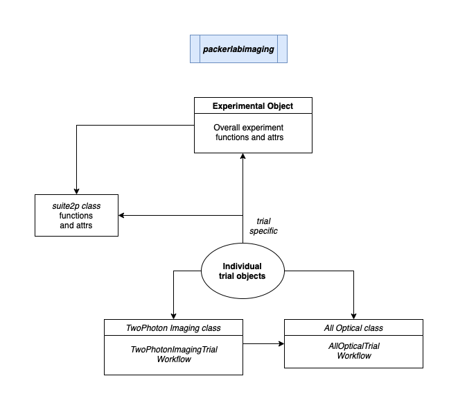

# packerlabimaging package

packerlabimaging is a simple Python package for essential processing and analysis of 2photon imaging data collected in the Packer Lab. 
Especially, there is a fully complete code pipeline for analysis and plotting of standard Ca2+ imaging data, and of standard all optical experiments (both 2photon optogenetic stim and 1photon optogenetic stim, with combined 2photon Ca2+ imaging).

This package is designed to work best with imaging experiments performed using PackIO, a Bruker 2pPlus microscope and using Suite2p for Ca2+ imaging 
data processing for ROI detection. Ultimately, the goal of this package is to jump-start your own analysis of your awesome experiment. 
We hope that it provides a useful structure to organize your experimental data, and some functionality to interact and process your data in an efficient manner. 

**Data Analysis Structure and Organization**

The data organization of the package follows object-oriented programming in Python.
There are two general types of objects within packerlabimaging: the *Experiment* object and the *Trial* object.
In general, it follows that a typical 2photon imaging and/or all optical experiment contains multiple imaging trials of varying durations and/or combined 2photon imaging + optogenetic stim. 
The primary entry point of the package is the Experiment object. 
Multiple individual Trial objects are collected in a single Experiment object. 

The definition of an "experiment" is purposefully loose to allow for accommodation across different experimental designs.  
On the other hand, a "trial" is strictly a single time series of 2photon imaging data collection. 
Each trial may correspond to either a 2photon imaging only or an all optical trial. 

*Experiment class*

Each imaging experiment is associated with a super-class Experiment object. Each Experiment object has optional access to Suite2p processing associated with that Experiment. 
Given this structure, each Experiment is meant to be built from all individual imaging trials that are closely related to each other based on their imaging characteristics. 
Most presciently, all imaging trials that are run together in Suite2p can be part of a single Experiment. 

*TwoPhotonImagingTrial class*

*AllOpticalTrial class*

**Data Structure Inside Trial objects**

Numpy arrays are heavily used to collect/store raw and processed data inside each Trial object. 
There are multiple Trial object attributes which store data, with each attribute dedicated to a specific method of data processing.

